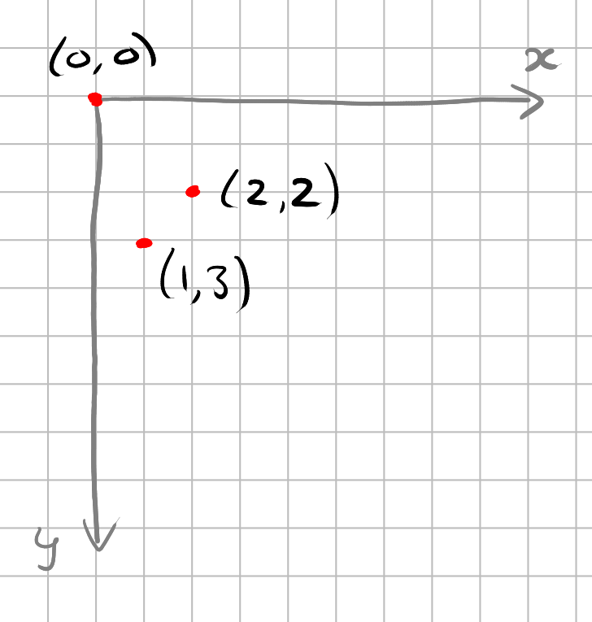
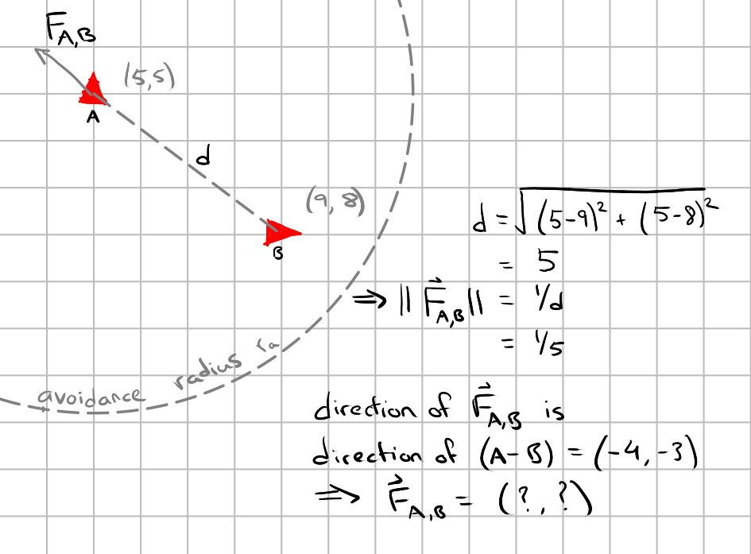
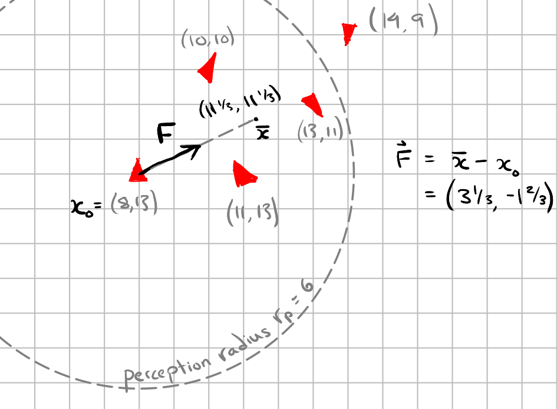
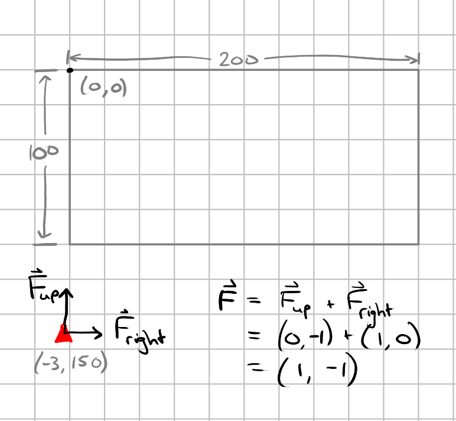

# Boids 🐦

## Introduction
Let us play with boids! 
In this exercise, you will be writing a simulation of a flock of boids. A boid is like a bird, but not exactly. Its behavior is dictated by four rules, in addition to [Newton’s laws of physics](https://en.wikipedia.org/wiki/Newton's_laws_of_motion):

* Avoidance: Avoid getting too close to any neighbor.
* Cohesion: Avoid getting too far from any neighbor.
* Alignment: Try to match the flight direction of its neighbors.
* Containment: Avoid going beyond the edge of the world.

(The difference between a boid and a bird is that the behavior of a boid is completely determined by the four rules above. It does not do anything else.) The simple rules above can give rise to many different, interesting, organic, and even beautiful emergent behaviors of the flock. As a small example with one choice of parameters:

>[!NOTE]
> This exercise aims to exercise the following concepts and techniques:
> * Basic Scala syntax, such as defining methods and values, calling methods, conditionals, arithmetic
> * Using (but not defining) simple immutable functional datatypes
> * Higher-order functions
> * Making and testing hypotheses about the behavior of computer systems

## Logistics
For this exercise, you will work on the [`BoidLogic.scala`](src/main/scala/boids/BoidsLogic.scala) file. If you have issues with your setup (Scala installation, IDE, using the terminal, etc.), please call us. 

__As always, your are allowed to copy/clone/fork this repository, but not to share solutions of the exercise in any public repository or web page.__

## Theory of the boid world
The boid world is a rectangle of a given width and height, with an x-y coordinate system with the origin in the top left of the rectangle and y increasing downwards (this is customary for computer graphics).

> **Check yourself!**
> 
> On a piece of paper, sketch the axes and the points (0, 0), (1, 3), and (2, 2). Compare your answer with the picture below.
>  

> 
 Solution 

> 
> 
> 
> 
 

Each boid has a position and a (vector) [velocity](https://en.wikipedia.org/wiki/Velocity). Each boid is subject to four forces corresponding to the four rules mentioned above, and we know from Newton that force equals mass times acceleration; but all boids have unit mass, so forces will be directly synonymous with (vector) accelerations.

The unit of position or distance is given by the coordinate system. The unit of velocity is typically distance per unit time—but what is the unit of time? In the boid world, time proceeds in discrete ticks instead of continuously, and the state of the flock is recomputed on every tick. Thus the unit of velocity is distance per tick. And as there are no subdivisions of ticks and the world is recomputed only on every tick, the position of a boid equals the sum of its position and velocity on the previous tick. (With continuous time, we would have had to integrate…) Likewise, the velocity of a boid equals the sum of its velocity and the total acceleration due to the four rules on the previous tick.

In other words, if $x_t$ is the position of a boid at tick $t$, $v_t$ its velocity, and $a_t$ its acceleration due to the four rules, then:

$$
\begin{align}
  x_{t+1} = x_t + v_t \\
  v_{t+1} = v_t + a_t
\end{align}
$$

> **Check yourself!**
> 
> In physics class, you have probably seen equations like $v(t) = x'(t)$ or $x(t) = x(0) + \int_{0}^{t}v(t)dt$. Can you see a connection between those and the equations above?
>  

> 
 Solution 

> 
> The Wikipedia page about [Riemann sums](https://en.wikipedia.org/wiki/Riemann_sum) is a good place to start to learn more. But this is bonus material, not required to solve this lab!
> 
> 
 

However, to ensure that the boids are neither lethargic nor hyperactive, the world clamps the magnitude of a boid’s velocity between a global minimum and maximum speed on every tick. Or in mathematical terms, we modify equation 2 from above, with $s_{min}$ and $s_{max}$ being the minimum and maximum speeds:

$$
∥ v_{t+1}  ∥ =
\begin{cases}
s_{min} \qquad \qquad \text{if} ~ ∥ v_{t} + a_{t}  ∥  < s_{min} \\ 
s_{max} \qquad \qquad \text{if} ~ ∥ v_{t} + a_{t}  ∥  > s_{max} \\
∥ v_{t} + a_{t}  ∥  \qquad \text{otherwise}
\end{cases}
$$

> **Check yourself!**
> 
> Given a vector $v$ and a magnitude $m$, what is an expression for a vector in the same direction as $v$ but with magnitude $m$? What are its $x$ and $y$ components in terms of the original components?
> 
>  

> 
 Hint 

> 
> $\frac{v}{∥ v ∥}$ has has unit magnitude and the same direction as $v$.
> 
> 
 

The rules translate to forces as follows.

1. *Avoidance*: The world has a physical constant called the *avoidance radius* $r_{a}$.  
Consider a boid A. For all *other* boids B within radius $r_a$ of A, A experiences a force away from B proportional in magnitude to the inverse of its distance from B. Or in mathematical terms, if $F_{A, B}$ ​is the avoidance force experienced by A due to B and $d < r_a$ is the distance between them, then $∥ F_{A, B} ∥ = \frac{1}{d}$. The total avoidance experienced by A is the sum of all such forces $F_{A, B}$.

> **Check yourself!**
> 
> Suppose boid A is at (5, 5) and boid B is at (9, 8), and suppose that is within the avoidance radius. What is the magnitude of the force experienced by A due to avoidance of B? What are the x and y components of that force?
> 
> 

> 
 Solution 

> 
> 
> 
> 
 

>[!WARNING]
> If boids A and B are at the same position, according to the description above, the avoidance force between them would be infinite! (And in what direction?) To avoid this problem, we will say that the avoidance force between two boids at the same position is zero.
> 
> This does not apply to any of the other forces. What is special about this force? What would happen in a computer simulation if we didn’t account for this?

2. *Cohesion*: The world has a physical constant called the *perception radius* $r_p$, greater than the avoidance radius $r_a$.  
Each boid experiences a force towards the average position of all other boids within radius $r_p$ of it (those that it can 'perceive'), proportional to its distance from said average position. (The average position is effectively the center of mass.) Or in mathematical terms, let  $x_0$ be the (vector) position of this boid, and $B$ be the set of positions $x$ of *other* boids such that $∥x − x_{0}∥ < r_p$. Then the force is $\frac{\sum_{B}x}{|B|} - x_0$. If $|B| = 0$, i.e., if there are no boids within the perception radius, then the force is zero. 

> **Check yourself!**
> 
> Suppose $x_0$ is (8, 13) and the other boids’ positions are (10, 10), (13, 11), (11, 13), and (14, 9). Suppose that $r_p$ is 6. What is the magnitude of the cohesion force experienced by the boid at $x_0$ ? What are the x and y components of that force?
> 
> 

> 
 Solution 

> 
> 
> 
> 
 

3. *Alignment*: Each boid experiences a force proportional to the difference between the average velocity of all other boids in its perception radius and its current velocity. Or in mathematical terms, let $x_0$ and $v_0$ be the (vector) position and velocity of this boid, and $B$ be the set of positions $x$ and velocities $v$ of *other* boids such that $∥x − x_{0}∥ < r_p$. Then the force is $\frac{\sum_{B}v}{|B|} - v_0$. If $|B| = 0$, i.e., if there are no boids within the perception radius, then the force is zero.

4. *Containment*: If a boid goes beyond an edge of the world, it experiences a unit force in the opposite cardinal direction.

> **Check yourself!**
> 
> Suppose the world has height 100 and width 200. If a boid is at position (-3, 150), what containment force would it experience?
> 
> 

> 
 Solution 

> 
> 
> 
> 
 

Lastly, each of these rules is scaled by physical constants (just like, for instance, the force of gravity is scaled by the constant $G$ in the expression $\frac{GmM}{r²}$). These are called the *avoidance weight*, the *cohesion weight*, and so on. The total force experienced by a boid is thus the *weighted sum* of the four components. Different weights can lead to radically different emergent behaviors of the flock!

## Implementing the flock simulation

Your task in this exercise is to convert the theoretical description of boids above into a computer simulation. We’ve already provided some parts for you. You are free to inspect the implementations, but don’t worry at all if you don’t understand them, because they use many concepts and techniques that you have not learned yet, unlike the parts that you will write.

* The `boids` package contains the core of the simulation. `Boid.scala` and `World.scala` are the ‘support structure’, while `BoidLogic.scala` is where you will write the main logic.
* The `p2` package provides:
  * A datatype for two-dimensional vectors, `Vector2`, with many utility methods for computing with vectors. For instance, you can simply use `+` to add two vectors.
  * Datatypes for collections of boids, vectors, and floats. They use the `Cons`-`Nil` structure for sequences that you are familiar with by now, and include implementations of many common functions (such as `map`). Note that for this lab, we don’t actually care about the *order* or *indices* of the items in the collection, so a sequence is technically more powerful than needed!
  
  Although you may not understand all the code in this package, read the documentation (in` /** ... */`) to get a sense of what methods are available to you. You are of course always free to implement more helper functions that work with these datatypes on your own in `BoidLogic.scala`.
* The `ui` package provides a graphical user interface for viewing the simulation. Instructions for using it are in [How to use the UI](#how-to-use-the-ui) just below.
* The `src/test/` directory has tests which you can check your implementation against. Instructions for using it are in [How to use the tests](#how-to-use-the-tests) just below.

You must write all your code in `BoidLogic.scala`. You may not change the names or signatures of the methods already defined, but you are free to add new ones as you see fit. Your code must pass all the tests. 

### How to Use the UI

If the UI is not already running, e.g. if you are just starting to work on the exercise, then start the UI as follows:

1. In a terminal, navigate to the root directory of the exercise: [programming-2-ex-5/boids/](./).
2. Run `sbt` to start SBT.
3. At the SBT prompt, run `run` to start the UI server.
4. In your browser, go to `localhost:8080/`.

> **Check yourself!**
>
> Try it now! The UI shows your simulation in blue and the reference solution in green. **Your blue boid will not move**, since you haven’t implemented anything yet. The reference solution is available only because a preset initial configuration is selected by default. If you change the configuration, e.g. the initial position of the boid, the reference solution will disappear. 

If the UI is already running, and you have made some changes to the code, then you have to restart it to see your changes as follows:

1. In the terminal where you did step 3 above, press `Ctrl+C` (or `⌘-C` on Macs) twice to stop the UI server. This will bring you back to the SBT prompt.
2. Run `run` to start the UI server.
3. In your browser, refresh the page you opened in step 4 above, or simply open a new page at the same URL.
  
If you see an error like the following:

`
[error] java.net.BindException: Address already in use
`

It indicates that the UI server is already running on your computer in a different terminal window. Find and stop that instance of the server before starting a new one.

### How to Use the Tests

The best way to use the tests is through the UI! Each test case for the lab is an option under “initial configuration”, and they are presented in the same order as in the implementation guide below. When you select a test case, the UI shows the initial flock configuration and physics parameters, and draws the reference simulation in **green** (for the first few steps) on top of the simulation you are implementing in **blue**. From there, you can change the initial settings, but of course your custom settings will not have a reference simulation. The “debug mode” controls may be useful.

However, if you want to run the tests without the UI:

1. Stop the UI server as described above.
2. At the SBT prompt, run `test` to run the tests. They are run in the same order as in the “initial configuration” options in the UI.

## Implementation guide

> [!NOTE]
> 
> Before reading further, read through the template code in `BoidLogic.scala`. If you feel confident, go ahead and complete the implementation, using the UI and the tests to guide you, and skip to the [bonus section](#bonus-section-ornishology) if you want to try it. Otherwise, continue reading the implementation guide below.

### No rules

Ignore the four rules for the moment. How should a single boid behave under just Newtonian physics? That is, given an initial position and velocity, what should the boid’s position and velocity be in the next tick? Implement this behavior in the `tickBoid` function. For the moment, the value of `acceleration` will always be zero, so you can ignore it.

Then, given a flock of boids (a `BoidSequence`), what should the state of the flock be on the next tick? Implement this computation in the `tickWorld` function.

You can now check your work as described in [How to use the UI](#how-to-use-the-ui) or [How to use the tests](#how-to-use-the-tests). At this point, your code should match the reference simulation for the first 2 test cases: `singleBoidNoForces` and `threeBoidsNoForces`.

### Only avoidance

Now consider only the avoidance rule. Assume that you are in the middle of a simulation and you have to calculate the force on one particular boid resulting from that rule. Start with simple cases: if there are no other boids in the world, or only one other boid, or only one that is within the avoidance radius. How do you do it? **Start thinking on paper**. Consider writing a mathematical expression, drawing a diagram, etc. as you prefer. Then, **still on paper**, try to express your idea using the computational concepts you’ve seen in class: higher-order functions, recursion, accessing fields and methods of an object, etc. Finally, implement it as code by replacing the placeholder values in the `boidsWithinRadius` and `avoidanceForce` functions with proper implementations.

Remember that in `tickBoid` in the previous section, you ignored acceleration because it was zero. But now that you’ve implemented the avoidance rule, this will no longer be the case. How should you incorporate acceleration into your `tickBoid` function?

> **Check yourself!**
> 
> Take a moment to check your work. If two boids are heading straight towards each other, initially outside the avoidance radius, what should happen? **Write down your prediction**. Compare it with the `twoBoidsAvoidanceX` test case in the UI.

>[!NOTE]
> We have left `boidsWithinRadius` for you to implement, but we do not directly test it. It is used internally by `totalForce` to filter the set of boids before passing it to `avoidanceForce`, `cohesionForce`, and `alignmentForce`. You can modify it as you wish: we only test the final simulation. Of course, as the name indicates, our expectation is that you will find it useful to make it filter the complete list of boids to return only those to be considered when computing a given force.

Once you have correctly implemented the avoidance rule, your code should pass the next 5 test cases: `singleBoidAvoidance`, `twoBoidsAvoidanceX`, `twoBoidsAvoidanceXY`, `twoBoidsAvoidanceFar`, and `mixedAvoidance`.

### Cohesion
With the same process you used for implementing the avoidance rule—starting by calculating simple cases on paper, then expressing the same ideas using computational concepts, then writing code, and finally writing down and checking a hypothesis about a simple situation—implement the cohesion rule.

The next 5 test cases only rely on the cohesion rule, either because the avoidance weight is set to zero, or the boids are outside the avoidance radius. They are `twoBoidsRestCohesion`, `twoBoidsCohesionDance`, `twoBoidsCohesionFar`, `chaoticCohesion`, and `avoidanceCohesion`. The 2 test cases after that rely on both avoidance and cohesion: `avoidanceCohesionLonger` and `threeBodyProblem`.

### Alignment, containment, and full test suite
Now, implement the remaining rules. Identify repeated patterns and abstract them out (e.g. as helper functions) when you can; **copy-pasting code is not the right approach**! For each rule, check that your implementation is correct by running the simulation to see if it behaves as you expect. Feel free to modify the configurations in the UI to explore different behaviors.

Once you have implemented all the rules correctly, all tests should pass.

## Bonus Section: Ornishology

Ornishology is the study of boids (because it’s like ornithology, but not exactly). Here we have a flock that demonstrates remarkably complex and structured behavior arising from just a few simple rules implemented by individuals. In the natural world, we typically cannot change the rules *ceterus paribus* to find out how the behavior changes; ‘how would flocks organize if birds could only see with one eye?’ is a question we will probably never be able to answer. But with boids, we can!

Here are some questions to explore about the behavior of boids and flocks. For each, first write down a hypothesis about what you expect to see. Then run the simulation and compare your observations to your predictions.

1. What happens if the avoidance weight is doubled? Halved? How about the cohesion and alignment weights? (Change one thing at a time!)
2. Should anything change if all the weights are scaled by the same factor at once? Why or why not?
3. What happens if the perception radius is large enough to always contain all the boids in the world?
4. What happens if the minimum and maximum speed constraints are removed?
5. What happens if avoidance is proportional to the inverse of the square of the distance instead?
6. What happens if there is only a small number of boids, like 10? (Or a very large number, like 10,000, if you’re brave… your computer may struggle a little.)

Feel free to explore in other directions too. Can you come up with any generalizations about the behavior of boid flocks?
